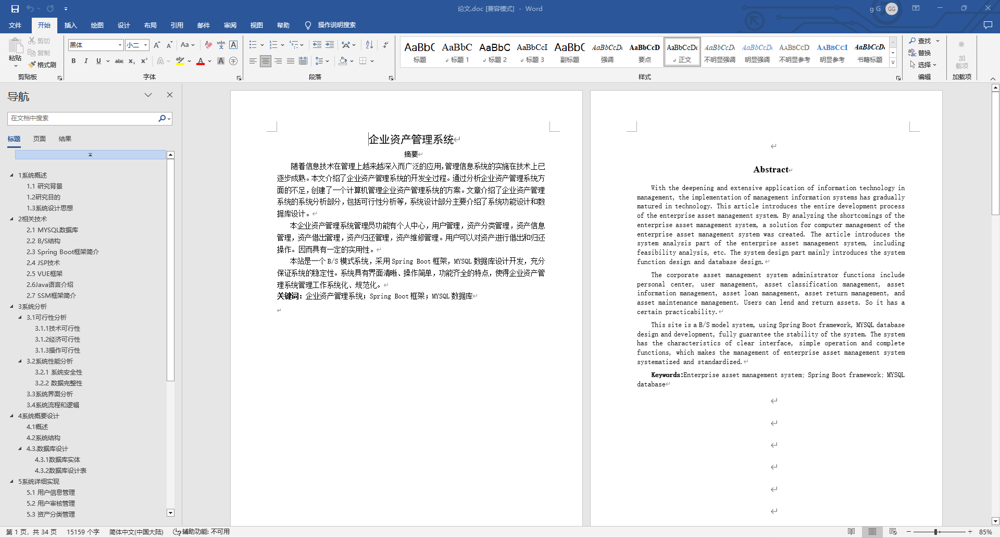
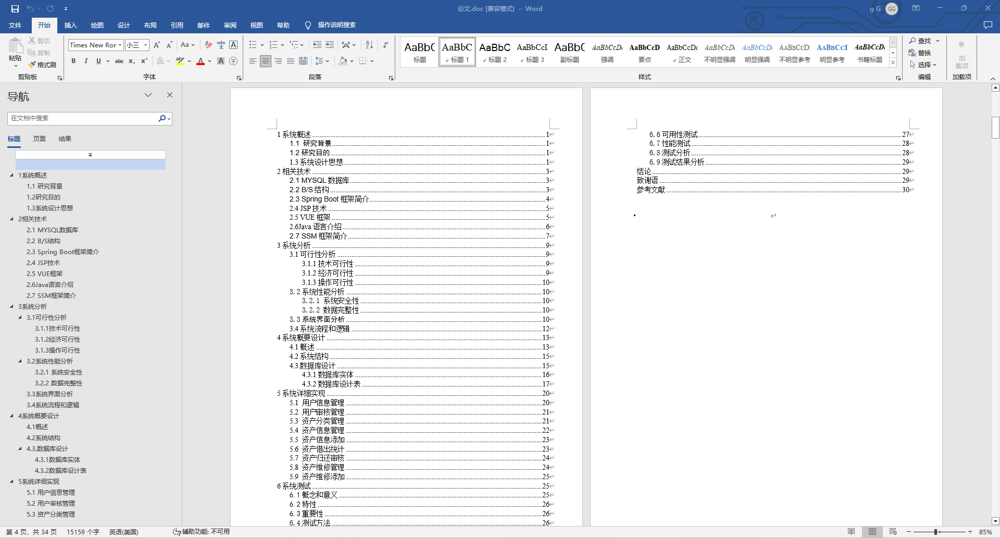
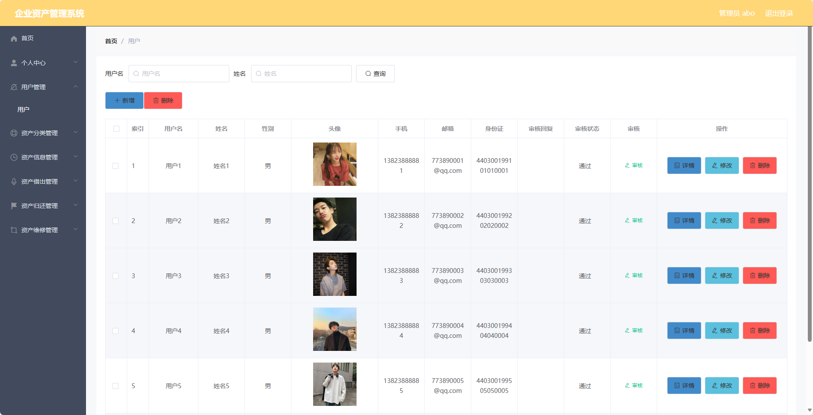
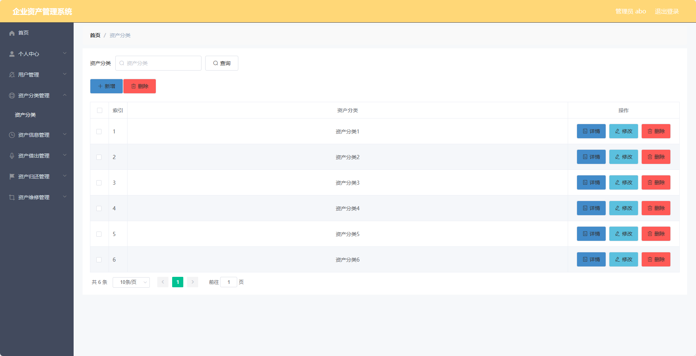
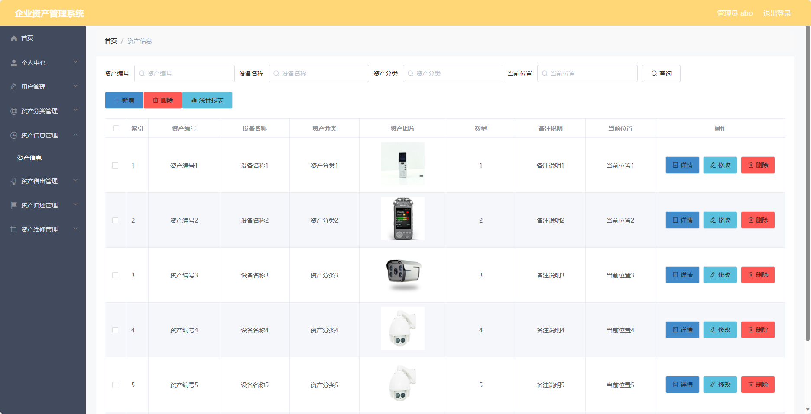
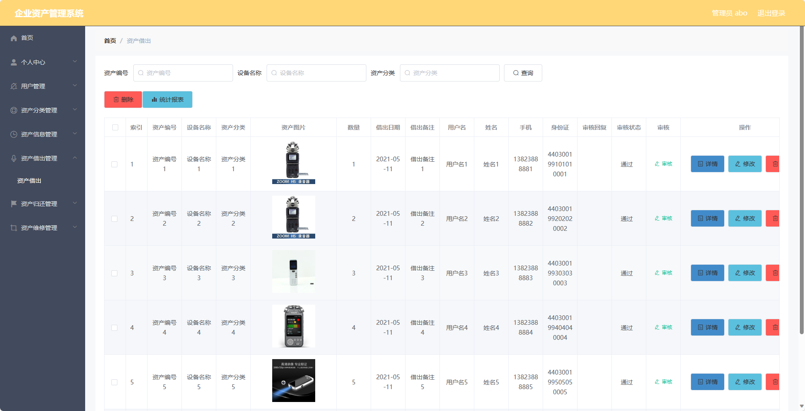
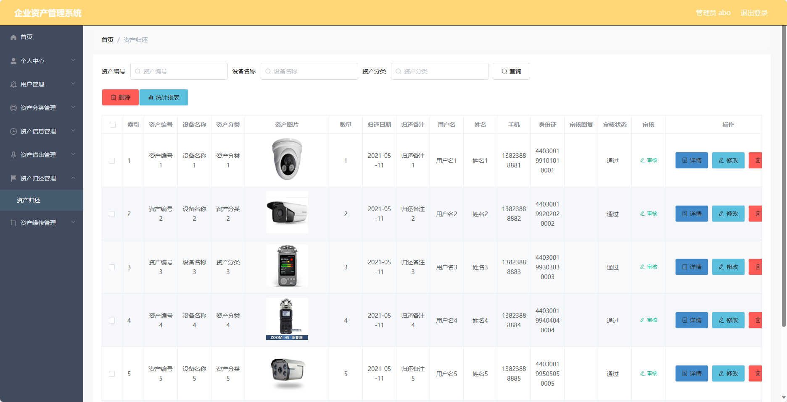
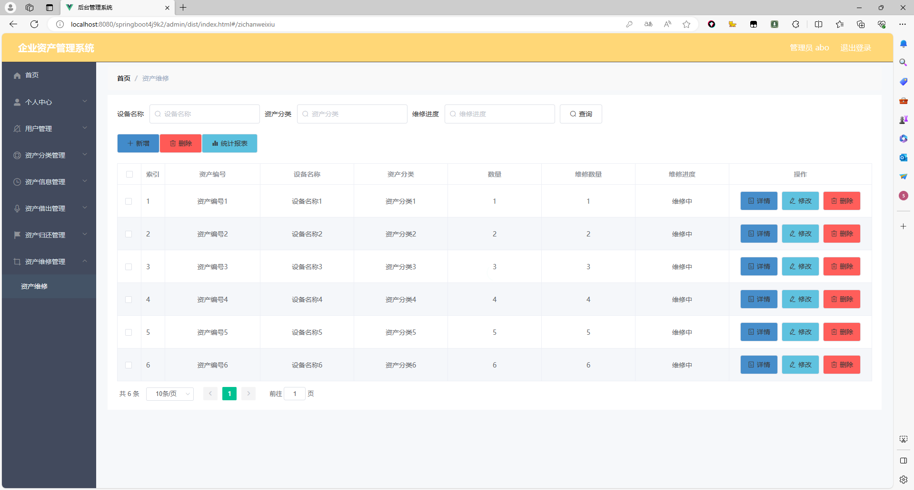
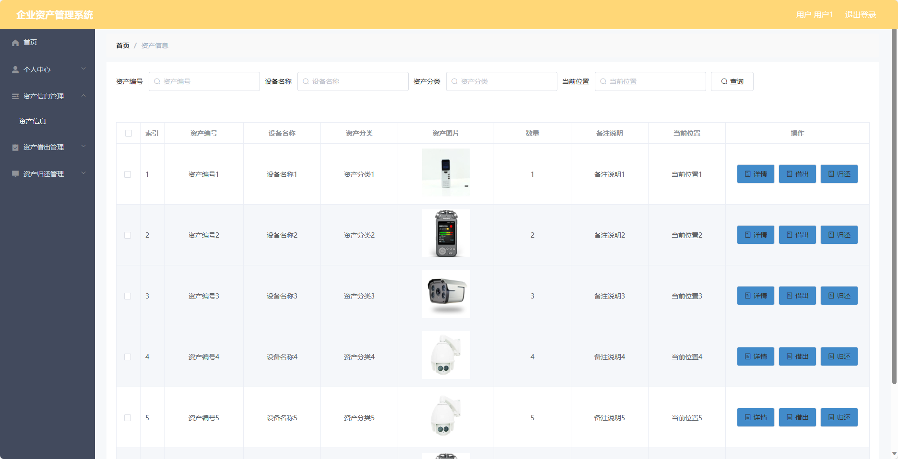

基于SpringBoot的企业资产管理系统（程序+论文）
=
- 完整代码获取地址：从戎源码网 ([https://armycodes.com/](https://armycodes.com/))
- 作者微信：19941326836  QQ：952045282 
- 承接计算机毕业设计、Java毕业设计、Python毕业设计、深度学习、机器学习
- 选题+开题报告+任务书+程序定制+安装调试+论文+答辩ppt 一条龙服务
- 所有选题地址https://github.com/nature924/allProject

一、项目介绍
---
基于Spring Boot框架实现的企业资产管理系统，系统包含两种角色：管理员、用户,系统分为前台和后台两大模块，主要功能如下。
### 管理员：

- 个人中心：管理员可以管理个人信息。
- 用户管理：管理员可以管理用户信息，
- 资产分类管理：管理员可以管理资产分类信息，
- 资产信息管理：管理员可以管理资产信息
- 资产借出管理：管理员可以管理资产借出记录，
- 资产归还管理：管理员可以管理资产归还记录，
- 资产维修管理：管理员可以管理资产维修记录，

### 用户：

- 个人中心：用户可以管理个人信息。
- 资产信息管理：用户可以查看、搜索和浏览资产信息。
- 资产借出管理：用户可以申请借出资产，查看借出记录和管理已借出的资产。
- 资产归还管理：用户可以申请归还资产，查看归还记录和管理已归还的资产。

二、项目技术
---
- 编程语言：Java
- 数据库：MySQL
- 项目管理工具：Maven
- 前端技术：VUE、HTML、Jquery、Bootstrap
- 后端技术：Spring、SpringMVC、MyBatis

三、运行环境
---
- 操作系统：Windows、macOS都可以
- JDK版本：JDK1.8以上都可以
- 开发工具：IDEA、Ecplise、Myecplise都可以
- 数据库: MySQL5.7以上都可以
- Tomcat：任意版本都可以
- Maven：任意版本都可以

四、运行截图
---
### 论文截图：

### 程序截图：

